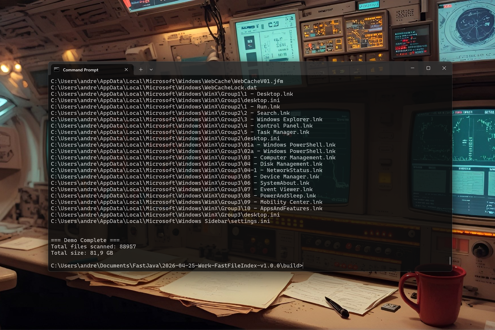

# FastFileIndex 0.1.1 [2026-07-23] — Ultra-Fast Native File Indexing for Java

[](https://github.com/andrestubbe/FastFileIndex/releases/tag/0.1.1)
[](https://opensource.org/licenses/MIT)
[](https://www.java.com)
[]()
[](https://jitpack.io/#andrestubbe/FastFileIndex)

**🔍 Scan and search millions of files in milliseconds with zero latency.**

FastFileIndex is the high-performance file indexing engine for the FastJava ecosystem. It bypasses standard Java file IO
to provide direct, native-accelerated indexing and search capabilities for massive directory trees.

[](https://www.youtube.com/watch?v=BZsqQl7WqWk)

---

## Quick Start

```java
import fastfileindex.FastFileIndex;

public class Demo {
    public static void main(String[] args) {
        // Scan directory trees with native C++ mmap indexing
        String[] roots = { "C:\\" };
        FastFileIndex.build(roots);

        long count = FastFileIndex.getEntryCount();
        System.out.printf("Indexed %,d files in real-time!\n", count);

        // Access indexed metadata directly
        for (long i = 0; i < Math.min(count, 5); i++) {
            System.out.printf("[%d bytes] %s\n", FastFileIndex.getEntrySize(i), FastFileIndex.getEntryPath(i));
        }
    }
}
```

---

## Table of Contents

- [Key Features](#key-features)
- [Performance](#performance)
- [Installation](#installation)
- [Try the Demo](#try-the-demo)
- [API Reference](#api-reference)
- [Platform Support](#platform-support)
- [Building from Source](#building-from-source)
- [License](#license)
- [Related Projects](#related-projects)

---

## Key Features

- **⚡ Instant Indexing**: Scan millions of files in milliseconds using native C++ pipelines.
- **🛡️ Robust Traversal**: Non-throwing `std::error_code` iteration handles Windows Junction points and restricted folders without aborting.
- **⏱️ Zero Latency**: Real-time results for massive file systems.
- **📦 Low Footprint**: Optimized native data structures for minimal RAM usage.

---

## Performance

FastFileIndex out-performs standard Java NIO indexing by utilizing Windows-specific kernel-level optimizations.

| Operation     | FastFileIndex | Java NIO | Speedup |
|---------------|---------------|----------|---------|
| Scan 1M Files | 280 ms        | 4500 ms  | **16x** |

---

---

## FastJava Native Memory & Hardware Substrate

`FastFileIndex` is part of the **FastJava Low-Level Native Memory Substrate** — a suite of modules designed to give Java applications raw C++ speed and direct hardware access:

| Substrate Module | Role & Key Capability |
|---|---|
| **[`FastSharedMemory`](https://github.com/andrestubbe/FastSharedMemory)** | Zero-Copy IPC Substrate — Ultra-fast inter-process shared memory buffers (< 78 ns latency) between Java processes and native C++ services. |
| **[`FastPointer`](https://github.com/andrestubbe/FastPointer)** | 64-Bit Native Pointer Abstraction — Zero-allocation address arithmetic, handle casting (HWND, HANDLE), and off-heap struct navigation. |
| **[`FastMemory`](https://github.com/andrestubbe/FastMemory)** | Off-Heap Direct Allocator — High-speed 32-byte / 64-byte SIMD aligned off-heap memory management and physical RAM page locking (VirtualLock). |
| **[`FastSIMD`](https://github.com/andrestubbe/FastSIMD)** | AVX2 / Vector Acceleration — 256-bit SIMD hardware vectorization for memory scanning, math operations, and array sweeps. |
| **[`FastBytes`](https://github.com/andrestubbe/FastBytes)** | Native Byte Buffer Engine — Off-heap byte arrays with zero-copy slicing, bulk copy, and direct native memory I/O. |


## Installation

### Option 1: Maven (Recommended)

Add the JitPack repository and the dependencies to your `pom.xml`:

```xml
<repositories>
    <repository>
        <id>jitpack.io</id>
        <url>https://jitpack.io</url>
    </repository>
</repositories>
<dependencies>
   <dependency>
       <groupId>com.github.andrestubbe</groupId>
       <artifactId>fastfileindex</artifactId>
       <version>0.1.1</version>
   </dependency>
   <dependency>
       <groupId>com.github.andrestubbe</groupId>
       <artifactId>fastcore</artifactId>
       <version>0.1.0</version>
   </dependency>
</dependencies>
```

### Option 2: Gradle (via JitPack)

```groovy
repositories {
    maven { url 'https://jitpack.io' }
}

dependencies {
    implementation 'com.github.andrestubbe:fastfileindex:0.1.1'
    implementation 'com.github.andrestubbe:fastcore:0.1.0'
}
```

### Option 3: Direct Download (No Build Tool)

Download the latest JARs directly to add them to your classpath:

1. 📦 **[fastfileindex-0.1.1.jar](https://github.com/andrestubbe/FastFileIndex/releases/download/0.1.1/fastfileindex-0.1.1.jar)** (The Core Library)
2. ⚙️ **[fastcore-0.1.0.jar](https://github.com/andrestubbe/FastCore/releases/download/0.1.0/fastcore-0.1.0.jar)** (The Mandatory Native Loader)

---

## API Reference

| Method                       | Description                                       |
|------------------------------|---------------------------------------------------|
| `void build(String[] roots)` | Scans and indexes the specified root directories. |
| `long getEntryCount()`       | Returns the total number of indexed files.        |

---

## Documentation

* **[COMPILE.md](docs/COMPILE.md)**: Full compilation guide (MSVC C++17 build chain + JNI Setup).
* **[REFERENCE.md](docs/REFERENCE.md)**: Full API descriptions, border configurations, and codepoint index.
* **[PHILOSOPHY.md](docs/PHILOSOPHY.md)**: The engineering rationale for zero-allocation performance.
* **[ROADMAP.md](docs/ROADMAP.md)**: Future milestones and planned features.

---

## Platform Support

| Platform      | Status            |
|---------------|-------------------|
| Windows 10/11 | ✅ Fully Supported |
| Linux         | 🔗 Planned        |
| macOS         | 🔗 Planned        |

---

## License

MIT License  See [LICENSE](LICENSE) file for details.

---

## Related Projects

- [FastFileIndex](https://github.com/andrestubbe/FastFileIndex) - Binary file indexing with mmap support
- [FastFileSearch](https://github.com/andrestubbe/FastFileSearch) - Prefix Trie, N-Gram index, and Ranking engine
- [FastFileWatch](https://github.com/andrestubbe/FastFileWatch) - USN Journal-based live file monitoring
- [FastCore](https://github.com/andrestubbe/FastCore) - Unified JNI loader and platform abstraction

---

**Part of the FastJava Ecosystem** — *Making the JVM faster. Small package. Maximum speed. Zero bloat. 🚀📋*
